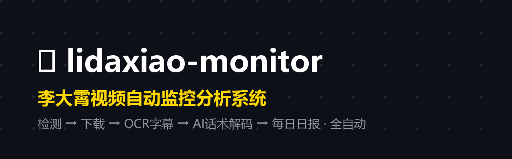
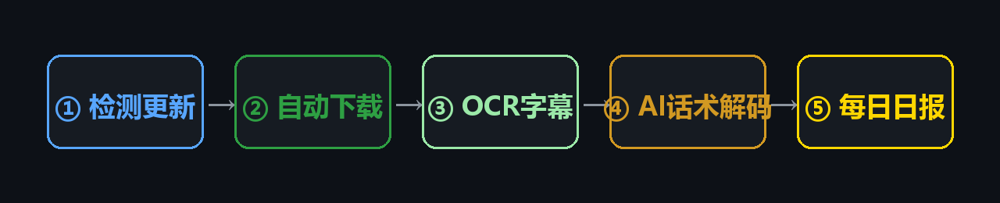
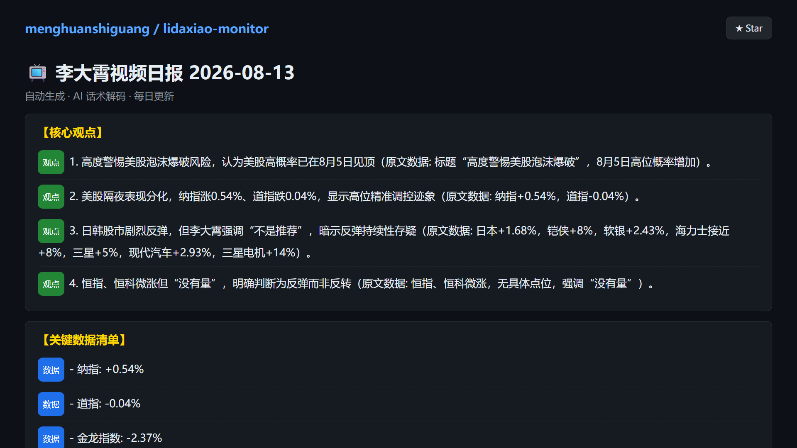

<p align="center">
  
</p>

<h1 align="center">📺 lidaxiao-monitor · 李大霄视频自动监控分析系统</h1>

<p align="center">
  <b>AI 全天候盯着李大霄的 B站主页 —— 检测 · 下载 · OCR字幕 · 话术解码 · 每日日报,全自动</b>
</p>

<p align="center">
  <a href="https://github.com/menghuanshiguang/lidaxiao-monitor/blob/main/LICENSE"></a>
  <a href="https://github.com/menghuanshiguang/lidaxiao-monitor/actions"></a>
  
  
  
</p>

---

## 🎯 它解决什么问题?

> **李大霄每天发 3-4 条视频**,你追不过来;
> 他满嘴 **"不是推荐"**,你猜不透真实意图;
> 他的观点天天变,**前后矛盾你记不住**。

这个项目让 **AI 替你盯着他**:新视频一发布,自动下载、自动识别字幕、自动拆解话术,生成一份**《李大霄话术解码日报》**——核心观点、关键数据、暗示提取、市场定性、观点连续性,打开就一目了然。

> 📊 **最新日报**: [查看 latest.md](./docs/reports/latest.md) · 📅 [全部日报索引](./docs/reports/index.md) · 📚 [周度总结](./docs/reports/weekly.md)

---

## ✨ 功能亮点

| | | |
|:---:|:---:|:---:|
| 🔍 **自动检测** | ⬇️ **自动下载** | 📝 **硬字幕 OCR** |
| 基于 bilidown CLI(内置 wbi 签名 + 412 反爬),状态文件对比,无新视频秒退 | 480P mp4 自动下载,失败自动重试;登录 cookies 解锁高清 | ffmpeg 抽帧 + RapidOCR,字幕带自动探测,去重/降噪;RTX 显卡 DirectML 加速 6-8 倍 |
| 🤖 **AI 话术解码** | 📄 **每日日报** | ☁️ **云端全自动** |
| AI 拆解:核心观点 / 关键数据 / **暗示提取(不是推荐=真实关注点)** / 市场定性 / 操作含义 / **观点连续性(升级/反转一眼看出)** | `reports/YYYY-MM-DD.md` 按日期归档,同天多视频追加,顶部当日摘要 | GitHub Actions 定时运行(每天 14:40 / 20:00),报告自动提交,电脑不用开机 |

**流程示意**

<p align="center">
  
</p>

---

## 📸 效果展示

**AI 生成的日报(真实内容, 2026-08-13《高度警惕美股泡沫爆破》)**

<p align="center">
  
</p>

---

## 🚀 快速开始(3 步)

### 1️⃣ 准备依赖

```bash
# Python 3.12+ / Git / ffmpeg (放入 tools/ffmpeg/bin/ 或加入 PATH)
pip install -r requirements.txt
git clone https://github.com/menghuanshiguang/bilibili-downloader-cli.git _repo
```

### 2️⃣ 配置密钥与登录

```bash
# AI 分析密钥: 主用 OpenCode Zen Go (模型 deepseek-v4-flash), 失败自动兜底 DeepSeek
echo "OPENCODE_GO_API_KEY=sk-xxxx" >> .env
echo "DEEPSEEK_API_KEY=sk-xxxx" >> .env

# B站扫码登录 (一次性, 解锁高清并降低风控)
python _setup/login_wait.py     # 浏览器打开二维码, B站App扫码
```

### 3️⃣ 运行

```bash
python monitor.py              # 无新视频秒退; 有新视频自动处理
python monitor.py --force      # 强制重新处理最新视频
```

> 💡 更多用法:批量补全历史字幕 `python batch_subtitles.py` · 发布规律分析 `python _setup/analyze_pubtimes.py` · 本地定时任务 `powershell -File _setup/install_schedule.ps1`

---

## ⏰ 自动运行(GitHub Actions)

本仓库内置 CI,配置两个 Secret 后即可云端全自动:

| Secret | 说明 |
|--------|------|
| `OPENCODE_GO_API_KEY` | OpenCode Zen Go API 密钥(AI 分析主通道,模型 `deepseek-v4-flash`,推理 `max`) |
| `DEEPSEEK_API_KEY` | DeepSeek API 密钥(兜底通道,OpenCode Go 失败时自动重试;可选但推荐) |
| `BILIBILI_COOKIES_B64` | B站登录 cookies(base64,由 `data/cookies.txt` 转换) |

```bash
gh secret set OPENCODE_GO_API_KEY --repo <your>/lidaxiao-monitor
gh secret set DEEPSEEK_API_KEY --repo <your>/lidaxiao-monitor
gh secret set BILIBILI_COOKIES_B64 --repo <your>/lidaxiao-monitor
```

- 每天 **北京时间 14:40 / 20:00** 自动运行(也可手动 `Run workflow`)
- 报告自动提交到 `docs/reports/`(日报保留 30 天)+ 上传 artifact
- 状态与字幕通过 Actions 缓存持久化,无新视频秒退,不重复分析

---

## 📂 目录结构

```
├── monitor.py              # 主脚本 (检测/下载/OCR/分析/报告)
├── batch_subtitles.py      # 批量字幕提取 (全量历史视频, 断点续传)
├── config.json             # 配置 (UID/OCR/LLM)
├── requirements.txt        # Python 依赖
├── _setup/
│   ├── login_wait.py       # B站扫码登录辅助
│   ├── install_schedule.ps1# 本地计划任务安装 (科学化7次/天)
│   ├── fetch_pubdates.py   # 拉取UP主历史发布时间
│   ├── analyze_pubtimes.py # 发布规律分析
│   └── weekly_summary.py   # 周度总结生成
├── docs/reports/           # 自动生成的日报 (CI 提交)
├── data/                   # 状态/字幕/帧 (运行时生成, 不入库)
└── reports/                # 本地日报 (不入库)
```

---

## ❓ FAQ

**Q: "不是推荐"到底是什么?**
A: 李大霄的合规话术。本项目 AI 会专门提取这类暗示,标注语境(机会暗示/风险警示)和情绪(🔴警示/🟢看多/⚪中性/⚠️风险)。

**Q: 为什么用 OCR 而不是官方字幕?**
A: 多数视频无官方字幕,且硬字幕(画面内文字)才是他真正展示的内容——点位、百分比、表格全在画面上。

**Q: 本地跑还是云端跑?**
A: 都可以。GitHub Actions 云端全自动(推荐);本地 Windows 计划任务同样支持(科学化 7 次/天,基于 400 条发布历史统计)。

**Q: cookies 失效了怎么办?**
A: 重新扫码登录后更新 Secret:`python _setup/login_wait.py` → 转换 base64 → `gh secret set BILIBILI_COOKIES_B64`。

**Q: 每天跑多少次最合理?**
A: 数据分析显示李大霄日均发布 3.67 条,高峰在 10-15 时(40%)与 18-23 时(43%),中位间隔 3 小时。云端 2 次 + 本地 7 次方案见 `发布规律分析.md`。

---

## 🧩 技术栈

[bilidown CLI](https://github.com/menghuanshiguang/bilibili-downloader-cli)(B站反爬/下载) · ffmpeg(抽帧) · RapidOCR + onnxruntime(-directml)(OCR) · OpenCode Zen Go API(AI 分析主通道) + DeepSeek API(兜底) · GitHub Actions(定时/部署)

## ⚖️ 免责声明

本项目所有分析均为对视频内容的**自动化提炼,不构成任何投资建议**。投资有风险,入市需谨慎。

## 📄 License

[MIT](./LICENSE) © 2026 [menghuanshiguang](https://github.com/menghuanshiguang)

---

<p align="center">
  <b>如果这个项目对你有帮助,点个 ⭐ Star 就是最大的支持!</b>
</p>
