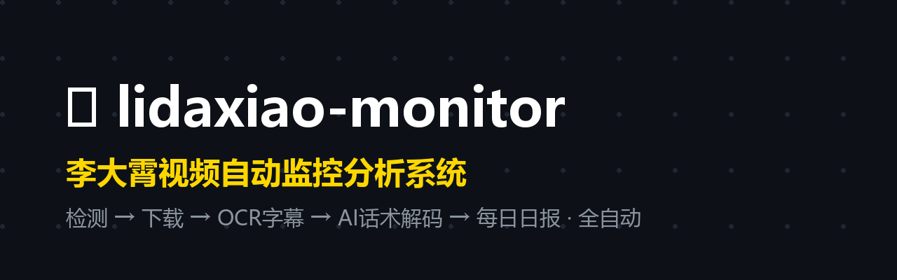
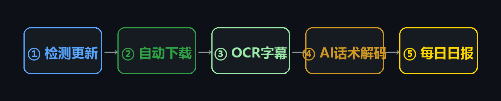
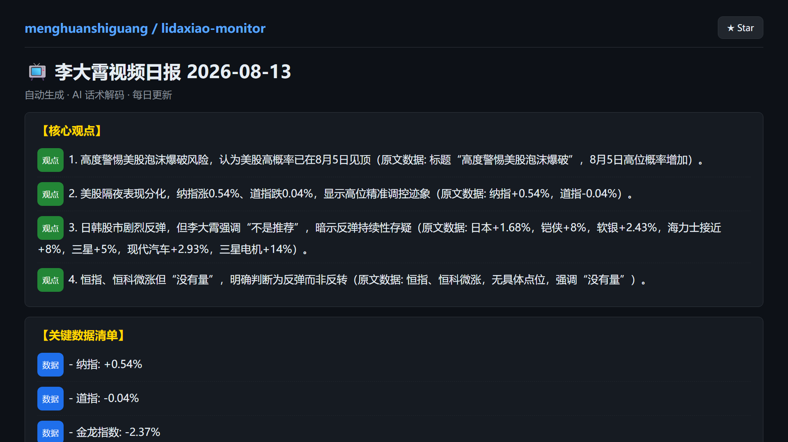

<p align="center">
  
</p>

<h1 align="center">📺 lidaxiao-monitor · 李大霄视频自动监控分析系统</h1>

<p align="center">
  <b>AI 全天候盯着李大霄的B站主页 —— 检测 · 下载 · OCR字幕 · 话术解码 · 每日日报,全自动</b><br>
  <b>免密免费 AI 层开箱即用 · 云端 Actions + 本地守护双保险,永不漏更</b>
</p>

<p align="center">
  <a href="https://github.com/menghuanshiguang/lidaxiao-monitor/blob/main/LICENSE"></a>
  <a href="https://github.com/menghuanshiguang/lidaxiao-monitor/actions"></a>
  
  
  
</p>

---

## 🎯 它解决什么问题?

> **李大霄每天发 3-4 条视频**,你追不过来;
> 他满嘴 **"不是推荐"**,你猜不透真实意图;
> 他的观点天天变,**前后矛盾你记不住**。

这个项目让 **AI 替你盯着他**:新视频一发布,自动下载、自动识别字幕、自动拆解话术,生成一份**《李大霄话术解码日报》**——核心观点、关键数据、暗示提取、**片尾暗示(视觉识别)**、市场定性、观点连续性,打开就一目了然。

> 📊 **最新日报**: [查看 latest.md](./docs/reports/latest.md) · 📅 [全部日报索引](./docs/reports/index.md) · 📚 [周度总结](./docs/reports/weekly.md)

---

## ✨ 功能亮点

| | | |
|:---:|:---:|:---:|
| 🔍 **自动检测** | ⬇️ **自动下载** | 📝 **硬字幕 OCR** |
| bilidown CLI(wbi 签名 + 412 反爬),状态对比,无新视频秒退;只处理**前天以来**的视频,`--force` 可强制 | 480P mp4,失败重试;**完整性校验**(ffprobe 实际时长 ≥97% 才算下全,截断自动重下) | ffmpeg 抽帧 + RapidOCR,字幕带自动探测,去重/降噪;RTX 显卡 DirectML 加速 6-8 倍 |
| 🤖 **AI 话术解码** | 📄 **每日日报** | ☁️ **云端 + 本地双保险** |
| 核心观点 / 关键数据 / **暗示提取**("不是推荐"=真实关注点) / 市场定性 / 操作含义 / **观点连续性**(延续/升级/反转一眼看出) | `reports/YYYY-MM-DD.md` 按日期归档,同天多视频追加,顶部当日摘要;发布时按 BV 合并进 `docs/reports/` | Actions 定时(14:40/20:00)+ 本地守护(**14:39/19:59,早 1 分钟**),`gh variable` 认领标志互斥,**谁先跑另一方自动跳过** |
| 🎬 **片尾暗示识别** | 🖼️ **视觉模型读屏** | 🆓 **免密免费 AI 层** |
| 片尾卡片(结束语/荐书卡/合规声明/数据面板)+**图形动画**(地球≈地球顶、钻石≈钻石底、婴儿底)——OCR 全丢,改用**视觉模型**读,报告单列【片尾暗示】 | 16×16 签名去重 + **最远点采样**选帧(≤6 帧覆盖口播/卡片/动画/声明);画面比喻单独提取为 **🎯 画面图形暗示**(形态 → 含义 → 🔴/🟢)置顶 | `opencode-zen-free` 公共免密网关(**零密钥**),文本 + 片尾识图双链路,默认置顶;挂了自动落到下面 4 级兜底 |

**流程示意**

<p align="center">
  
</p>

---

## 🏗️ 系统架构: 一个入口, 云端本地双跑

所有入口都汇聚到 **`lidaxiao.py`**(自动识别运行环境),核心流水线在 **`monitor.py`**:

```
                     ┌─────────────────────────────────────────┐
   Actions 定时       │  ☁️ GitHub Actions (windows-latest)      │
   14:40 / 20:00      │  python lidaxiao.py --once [--force]    │
        ┌─────────────┤  ① 查认领标志: 本地在跑(≤30min) → 跳过   │
        │             │  ② 否则: 重置状态 → monitor → 发布报告   │
        │             └─────────────────────────────────────────┘
        │  互斥靠 gh variable LOCAL_DAEMON_CLAIMED_AT (认领标志)
        │             ┌─────────────────────────────────────────┐
        └─────────────┤  🖥️ 本地守护 (14:39 / 19:59, 早1分钟)     │
   local_daemon.py /   │  ① 云端已有今日报告?云端正在跑? → 跳过   │
   托盘版 / 计划任务     │  ② 否则: 写认领标志 → git pull 同步状态   │
                       │  ③ LIDAXIAO_LOCAL=1 跑 monitor (Ollama) │
                       │  ④ 报告+状态 git push [skip ci]          │
                       │  ⑤ ollama stop 释放内存 → 清认领标志      │
                       └─────────────────────────────────────────┘
                                          │
                                          ▼
                       reports/YYYY-MM-DD.md → (按BV合并) → docs/reports/
                                          │
        monitor.py 流水线 ────────────────┘
        检测 → 下载+完整性校验 → 抽帧OCR → 片尾取帧 → 视觉识别片尾
             → AI 话术解码(免费层→4级兜底) → 写日报(含观点连续性)
```

- **本地崩了怎么办**:认领标志 30 分钟自动过期,云端照常接管;云端挂了,本地检查到无报告会补跑。
- **状态永远一份**:`state/`(last_bvid / processed / 片尾识别缓存)**入库随仓库同步**,本地每次运行前 `git pull --ff-only`,云端本地互不重复分析。

---

## 📸 效果展示

**AI 生成的日报(真实内容, 2026-10-02《外资不要利用假期搞小动作》)**

<p align="center">
  
</p>

---

## 🚀 快速开始(3 步)

### 1️⃣ 准备依赖

```bash
# Python 3.12+ / Git / ffmpeg (放入 tools/ffmpeg/bin/ 或加入 PATH)
pip install -r requirements.txt
git clone https://github.com/menghuanshiguang/bilibili-downloader-cli.git _repo
```

### 2️⃣ 配置(密钥可选,B站登录建议做)

```bash
# 🆓 AI 分析: 什么都不配也能跑 —— 免密免费层默认置顶 (mimo-v2.6-flash-free)
#    想走更稳的付费兜底链再配 (全部可选, 缺谁自动跳过谁):
echo "OPENCODE_GO_API_KEY=sk-xxxx" >> .env   # 主通道 OpenCode Zen Go
echo "DSV_TOKEN=xxxx" >> .env                # 第二兜底 deepseek-chat-cli
echo "DEEPSEEK_API_KEY=sk-xxxx" >> .env      # 最后兜底 DeepSeek 官方

# B站扫码登录 (建议: 解锁高清 + 降低 412 风控)
python _setup/login_wait.py     # 浏览器打开二维码, B站App扫码
```

### 3️⃣ 运行

```bash
python lidaxiao.py --once          # ⭐ 统一入口: 手动跑一次 (自动识别云端/本地)
python lidaxiao.py --daemon        # 本地常驻守护 (14:39/19:59 到点自动跑)
python lidaxiao.py --once --force  # 强制处理最新视频 (豁免日期过滤, 按发布日写报告)

python monitor.py                  # 直接跑核心流水线 (无新视频秒退)
python monitor.py --check-vision   # 自检片尾视觉通道 (不下载不分析)
```

> 💻 **Windows 懒人包**:`run_monitor.cmd`(计划任务/手动包装,日志进 `data\run.log`)· `start_local_daemon.cmd`(本地守护,Ollama 环境已预设)· `local_daemon_tray.py`(**托盘版**:右下角常驻,菜单 立即运行/查看日志/退出)
>
> 💡 **更多用法**:批量补全历史字幕 `python batch_subtitles.py` · 发布规律分析 `python _setup/analyze_pubtimes.py` · 本地计划任务 `powershell -File _setup/install_schedule.ps1`(科学化 7 次/天)· 失败重跑 `python _setup/reset_failed_state.py`

---

## ⏰ 自动运行(GitHub Actions + 本地守护)

### 云端: 内置 CI,配好 Secret 即全自动

| Secret | 必需? | 说明 |
|--------|------|------|
| `BILIBILI_COOKIES_B64` | ✅ 必需 | B站登录 cookies(base64),下载/风控用 |
| `OPENCODE_GO_API_KEY` | 可选 | OpenCode Zen Go API(AI 主通道,模型 `deepseek-flash`) |
| `DSV_TOKEN` | 可选 | DeepSeek 网页版 token(第二兜底 deepseek-chat-cli) |
| `DEEPSEEK_API_KEY` | 可选 | DeepSeek 官方 API(最后兜底) |

> 🆓 **三个 AI 密钥一个都不配也能跑**:免密免费层(`opencode-zen-free`)默认开启,文本 + 识图全覆盖。`deepseek-chat-cli` 仓库已公开,Actions 直接克隆,无需 PAT。

```bash
gh secret set BILIBILI_COOKIES_B64 --repo <your>/lidaxiao-monitor
gh secret set OPENCODE_GO_API_KEY --repo <your>/lidaxiao-monitor   # 可选
```

- 每天 **北京时间 14:40 / 20:00** 自动运行;手动 `Run workflow` 可勾选 **`force`** 输入强制重处理最新视频
- 运行前有**非阻断视觉预检**(`--check-vision`),额度/密钥问题提前打进日志,失败只跳过【片尾暗示】小节
- 状态走 Actions 缓存,无新视频秒退;报告 + `state/` 自动提交(`[skip ci]`),另上传 artifact 保留 14 天

### 本地: 守护进程与云端无缝错峰

```bash
python lidaxiao.py --daemon        # 或 python local_daemon.py / local_daemon_tray.py
```

- **时间错峰**:本地 14:39/19:59,比云端早 1 分钟;错过 slot 60 分钟内仍补跑
- **三方检查后才动手**:① 云端已有前天/昨天/今天的报告?② 云端 workflow 正在跑?③ 都没有 → 写认领标志(`gh variable set`,需先 `gh auth login`)→ 开跑
- **本地优先模型**:Ollama 本地大模型(`batiai/qwen3.6-35b:iq3`,MoE 40 专家下 CPU),零 API 成本;跑完自动 `ollama stop` 释放内存
- 报告/状态照常推送回仓库,与云端格式完全一致

---

## 🤖 模型选择与调用链(2026-10 更新)

**文本分析固定优先级**(`call_llm`,任一级失败/无密钥自动降级):

| # | 通道 | provider | 模型 | 密钥 |
|---|------|----------|------|------|
| 1 | 🆓 免密免费层(默认开启) | `opencode-zen-free` | `mimo-v2.6-flash-free` | **无需任何密钥** |
| 2 | OpenCode Zen Go | `opencode-go` | `deepseek-flash` | `OPENCODE_GO_API_KEY` |
| 3 | deepseek-chat-cli(网页版) | `deepseek-chat-cli` | 网页版会话 | `DSV_TOKEN` |
| 4 | DeepSeek 官方 API | `deepseek` | `deepseek-flash` | `DEEPSEEK_API_KEY` |
| — | 本地模式(`LIDAXIAO_LOCAL=1`) | `ollama` | `batiai/qwen3.6-35b:iq3` | 无需密钥 |

**片尾视觉固定优先级**(`vision_providers`,网页版 CLI 不支持图片,识图不经过第 3 级):

`vision_free`(MiMo 免密) → `vision`(opencode-go `deepseek-flash`) → `vision_fallback`(DeepSeek 官方 `deepseek-flash`)

> 🔧 **免密层协议细节**(实测自 `zouyuxuan122/dsh-our-free-model`):必须 `stream:true`(非流式 500/403);body 要带 bash/glob/grep/read 四个最小诱饵 tools + `tool_choice:none`;`reasoning_effort` 是空操作,思考与正文抢 `max_tokens` 所以预算靠顶满 `max_tokens`;免费额度按 session 计,`ses_`/`msg_` id 用 sha256 稳定派生。以上均已内置,无需配置。
>
> 🔧 **想关掉免费层**:`config.json` 里设 `"llm_free": {"enabled": false}` / `"vision_free": {"enabled": false}`。

**DeepSeek 官方模型名(2026-09 起)**:可用 `deepseek-flash`(=V4.1-Flash,唯一支持图像理解)、`deepseek-v4-pro`。旧名 `deepseek-chat`/`deepseek-reasoner`/`deepseek-v4-flash` 已下线,请求由 V4.1 Flash 承接。思考强度 `reasoningEffort`: `low`/`high`/`max`(`config.json` 配置,留空关闭)。

> 💰 省钱提示:官方 API 空闲时段(非工作日/非 9:00-12:00、14:00-18:00)半价;或者干脆全用免费层 + 本地 Ollama。

---

## 📂 目录结构

```
├── lidaxiao.py              # ⭐ 统一入口 (--once 云端/本地自适应, --daemon 本地守护)
├── monitor.py               # 核心流水线 (检测/下载/OCR/片尾视觉/AI分析/报告)
├── local_daemon.py          # 本地常驻定时 + 认领标志互斥 + 报告发布
├── local_daemon_tray.py     # 托盘版 (pystray: 立即运行/查看日志/退出)
├── batch_subtitles.py       # 批量字幕提取 (全量历史, 多进程断点续传)
├── config.json              # 配置 (UID/OCR/LLM五级通道/片尾视觉)
├── requirements.txt         # Python 依赖
├── run_monitor.cmd          # Windows 计划任务包装 (日志 → data\run.log)
├── start_local_daemon.cmd   # Windows 本地守护启动 (Ollama 环境预设)
├── agent_task.md            # 项目最初的任务书 (需求与验收标准)
├── 发布规律分析.md           # 400 条发布样本统计 → 定时方案依据
├── _setup/
│   ├── login_wait.py        # B站扫码登录
│   ├── install_schedule.ps1 # 本地计划任务安装 (科学化 7 次/天)
│   ├── fetch_pubdates.py    # 拉取UP主历史发布时间
│   ├── analyze_pubtimes.py  # 发布规律分析
│   ├── weekly_summary.py    # 周度总结生成
│   ├── week_process.py      # 指定日期段补处理 (周报/补全)
│   ├── reset_failed_state.py# 清失败状态, 让下次 Actions 自动重跑
│   └── chat_ollama.py       # Ollama 交互调试客户端
├── skills/daxiao-strategy/  # 🧠 策略研判 skill (报告 → 定性 → 逐仓操作)
├── docs/reports/            # 日报 (自动发布): index.md / latest.md / weekly.md
├── state/                   # 共享状态 (入库): last_bvid / processed / 片尾缓存
├── data/                    # 运行时 (不入库): 视频/帧/日志/锁
└── reports/                 # 本地日报 (不入库, 发布时按BV合并进 docs/reports)
```

---

## 🧠 配套 Skill: daxiao-strategy

[`skills/daxiao-strategy`](./skills/daxiao-strategy/SKILL.md) 把日报转成**可执行决策**(观点 → 定性 → 操作):

- **五级宏观定调**:A 高度警惕 → B 谨慎防御 → C 温柔市/止跌 → D 反弹(非反转) → E 结构性看多
- **老登/小登风格循环理论** + 话术解码表("XX不是推荐"=隐性推荐)
- **量能一票否决**:"没量=不是反转",缩量一律按反弹处理
- 流程:`market daxiao` 拉客观数据 → 读 `docs/reports/latest.md` → 定级 → 话术解码 → 逐仓动作

---

## ❓ FAQ

**Q: 一个密钥都没有,真的能跑吗?**
A: 能。免密免费层(`mimo-v2.6-flash-free`)默认置顶,文本分析和片尾识图都覆盖;配好 `BILIBILI_COOKIES_B64` 就能全流程无人值守。付费通道只是"更稳的兜底"。

**Q: 本地和云端会不会重复处理同一个视频?**
A: 不会,三重互斥:① 本地先跑并写 `gh variable` 认领标志,云端看到标志新鲜(≤30分钟)直接跳过;② 本地跑之前先查云端报告是否已存在、workflow 是否正在跑;③ `state/processed.txt` 入库同步,同 BV 不会分析两次。

**Q: "不是推荐"到底是什么?**
A: 李大霄的合规话术。本项目 AI 会专门提取这类暗示,标注语境(机会暗示/风险警示)和情绪(🔴警示/🟢看多/⚪中性/⚠️风险)。

**Q: 片尾暗示是怎么读的?为什么不用 OCR?**
A: 片尾有两类 OCR 拿不到的东西:① 整屏密集文字(合规声明/荐书卡/数据面板),会被"数字过多=噪声"规则丢掉;② **图形动画**(地球≈地球顶、钻石≈钻石底、婴儿底等标志性比喻)。所以用视觉模型读:片尾 45 秒取帧 → 签名去重 + 最远点采样选 ≤6 帧 → 输出【片尾口语/卡片/画面/画面暗示/数据/暗示】六行,按 BV 缓存进 `state/ending_hints.json`。设 `"vision": {"enabled": false}` 可关闭,主流程不受影响。

**Q: 什么叫"画面图形暗示"?**
A: 画面比喻比文字更能透露真实态度,刻意与文字暗示分列:

| 画面图形 | 含义 | 方向 |
|---|---|---|
| 地球 / 星球 / 地球仪 | **地球顶** | 🔴 高位见顶风险 |
| 钻石 / 宝石 | **钻石底** | 🟢 低位机会 |
| 婴儿 / 儿童 | **婴儿底** | 🟢 底部区域 |
| 山峰 / 登顶 | 顶部 / 高位 | 🔴 |
| 山谷 / 下坡 | 底部 / 低位 | 🟢 |
| 向上箭头 / 向下箭头 | 看多 / 看空 | 🟢 / 🔴 |
| 书 / 二维码等 | 不构成行情隐喻 | ⚪ 不附会 |

报告里单独置顶:`🎯 画面图形暗示: ...`;文字分析另加 `片尾图形:` 条目并要求体现在【操作含义】里。想重跑某视频:删掉 `state/ending_hints.json` 里对应条目(提示词版本号 `ENDING_PROMPT_VER` 升版会自动失效)。

**Q: `--force` 什么时候用?**
A: 强制重处理最新视频时用(`lidaxiao.py --once --force` / Actions 手动触发勾选 `force`)。会豁免"前天以来"的日期过滤,且报告按**视频发布日**命名、发布闸门走 mtime(6小时)兜底,旧视频也能正常归档发布。

**Q: 视频下载不完整会怎样?**
A: 用 B站元数据时长对比 `ffprobe` 实际时长,<97% 自动重下一次;仍残缺则报告打 `⚠️ 视频下载不完整`。这条校验必需——截断的 mp4 容器头仍报完整时长,ffmpeg 会提前结束,片尾窗口落在视频中间,读不到真正的片尾。

**Q: 为什么用 OCR 而不是官方字幕?**
A: 多数视频无官方字幕,且硬字幕(画面内文字)才是他真正展示的内容——点位、百分比、表格全在画面上。

**Q: cookies 失效了怎么办?**
A: `python _setup/login_wait.py` 重新扫码 → 转 base64 → `gh secret set BILIBILI_COOKIES_B64`。

**Q: 每天跑多少次最合理?**
A: 400 条样本统计:日均 3.67 条,高峰 10-15 时(40%)与 18-23 时(43%),中位间隔 3 小时 → 云端 2 次 + 本地守护 2 次 + 计划任务 7 次方案,依据见 [`发布规律分析.md`](./发布规律分析.md)。

---

## 🧩 技术栈

[bilidown CLI](https://github.com/menghuanshiguang/bilibili-downloader-cli)(B站反爬/下载) · ffmpeg(抽帧/片尾取帧/时长校验) · RapidOCR + onnxruntime-directml(OCR) · AI: 🆓 OpenCode Zen 免密层(`mimo-v2.6-flash-free`) → [OpenCode Zen Go](https://opencode.ai)(`deepseek-flash`) → [deepseek-chat-cli](https://github.com/menghuanshiguang/deepseek-chat-cli) → DeepSeek 官方 API · 本地 Ollama(`qwen3.6-35b`) · GitHub Actions + 本地守护进程

> **调用优先级**:文本 `免费层 → opencode-go → deepseek-chat-cli → DeepSeek 官方`;片尾识图 `免费层 → opencode-go → DeepSeek 官方`。每一级失败/无密钥自动降级,日志里能看到实际用了谁。

## ⚖️ 免责声明

本项目所有分析均为对视频内容的**自动化提炼,不构成任何投资建议**。投资有风险,入市需谨慎。

## 📄 License

[MIT](./LICENSE) © 2026 [menghuanshiguang](https://github.com/menghuanshiguang)

---

<p align="center">
  <b>如果这个项目对你有帮助,点个 ⭐ Star 就是最大的支持!</b>
</p>
